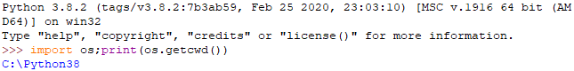

# Simple Relay Control Via Serial
Dokumentation by Roland, based of Orwa
## Content
- [Components](#Components)
- [Wiring Diagram](#Wiring-Diagram)
- [Prerequisites (installation)](#prerequisites-installation)
- [Usage instructions (as a libary)](#usage-instructions-as-a-libary)
- [Usage instructions (from the command line)](#usage-instructions-from-the-command-line)

## Components
1.  Hardware
2.  relay_sketch.ino
3.  relay.py

## Wiring Diagram

## Prerequisites (installation)
1.  PySerial package. To install type the following from the command prompt:
    
"pip install pyserial"

## Usage instructions (as a libary)
1.  Launch "idle" on windows
1.  Type: "import os:print(os.getcwd())"

1.  Copy "relay.py" to subdirectory "Lib" within the folder above (displayed in idle in blue)
1.  Now you can use the libary using "import relay" then calling the following functions:
    1.   relay.turn_on():  turns the relay on
    1.   relay.turn_off(): turns the relay off
1.  Note that if the hardware is not connected then an exception will be thrown when importing the libary
1.  Note that if the hardware is connected but being used by another program, an exception will also be thrown when importing the libary

## Usage instructions (from the command line)
1.  To turn on the relay from the command line, go to the folder where "relay.py" is stored and type the following commands:
    1.  "python relay.py 1" turns the relay on
    1.  "python relay.py 0" turns the relay off
1.  Note that if the hardware is not connected, an error message will be displayed.
1.  Note that if the hardware is connected but being used by another program, an error message will be displayed.
